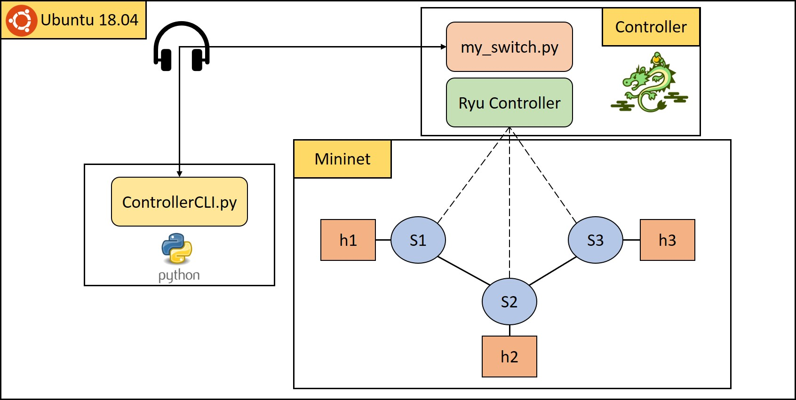
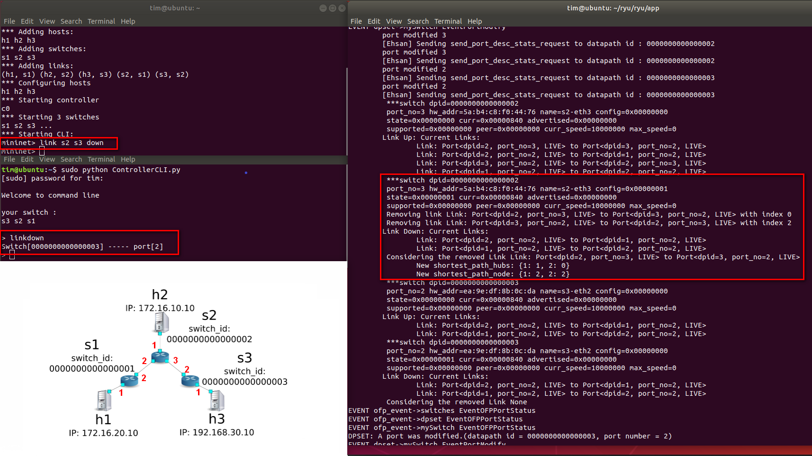

# Fast Path Detect And Recovery

|Author|Chieh-Ting Chung|
|---|---
|E-mail|sksksk1748@gmail.com

## Memo

* SDN , Fast Path Detection and recovery 

## Experiment environment
- Ubuntu 18.04
- Ryu Controller 4.34
- Mininet 2.3.0d6
- Python 2.7.17

## Environment Install Step
- [Step 1. Install ryu controller](https://github.com/YanHaoChen/Learning-SDN/tree/master/Controller/Ryu/Install)
- Step 2. Install Mininet
    ```bash
    $ sudo apt install mininet
    ```

## Your `~/Home/` folder should look like this
```
Home
├── ryu/
│   └── ryu/ ...
│       └── app/ ...
│           ├── gui_topology/
│           ├── ofctl/
│           ├── my_switch.py
│           └── ...
├── mininet/
├── ControllerCLI.py
└── ...
```

## Start
- Step 1. Use mininet to create network topology
    ```bash
    $ sudo mn --topo linear,3 --mac --controller remote
    ```
- Step 2. Start Ryu Controller in `~/ryu/ryu/app`
    ```bash
    $ sudo ryu-manager --verbose --observe-links my_switch.py
    ```
- Step 3. Open ControllerCLI
    ```bash
    $ sudo python ControllerCLI.py
    ```
- Step 4. At mininet
    ```bash
    mininet> link s2 s3 down
    ```
- Step 5. At ControllerCLI
    ```bash
    > linkdown
    ```

## If the socket port is occupied, refer to the following example
```bash
// 查詢 Port:80 狀態 
$ sudo netstat -lpn |grep 80

//範例,PID 2779
tcp  0  0  0.0.0.0:8080  0.0.0.0:*   LISTEN  2779/python

$ sudo kill -9 2779
```  

## Topology

* 

## Algorithm
- Dijkstra Algorithm

## Result


- `link s2 s3 down` 對 `Considering the remove Link Link: Port<dpid=2, port_no=3, LIVE> to Port<dpid=3, port_no=2, LIVE> 的 <dpid=2>` 來說 :
    - 這裡的`dpid`意思就是`Switch`
    - New shortest_path_hubs: {1: 1, 2: 0}
        - 1: 1 意思是 S2 到 S1 有 1 個 Hub(Switch)
        - 2: 0 意思是 S2 到 S2 有 0 個 Hub(Switch)
    - New shortest_path_node: {1: 2, 2: 2}
        - 1: 2 意思是，可以 h1 到 h2
        - 2: 2 意思是，可以 h2 到 h2

## Reference
- Efficient fast recovery mechanism in Software-Defined Networks: Multipath routing approach
- Demonstration of single link failure recovery using Bellman Ford and Dijikstra algorithm in SDN
- [Github Project: SDNMS](https://github.com/abba123/SDNMS)
